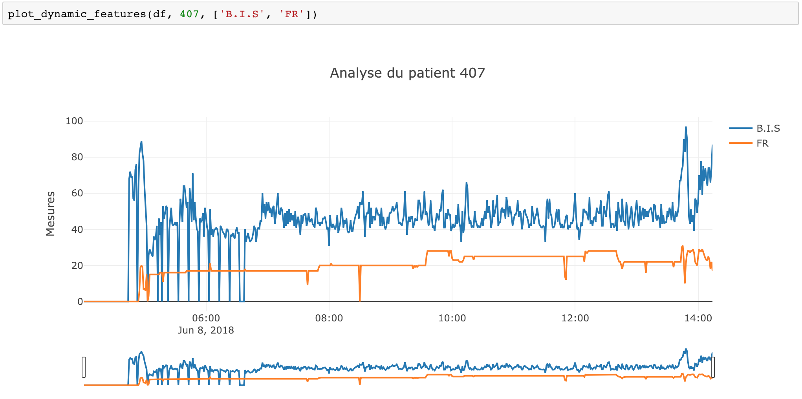
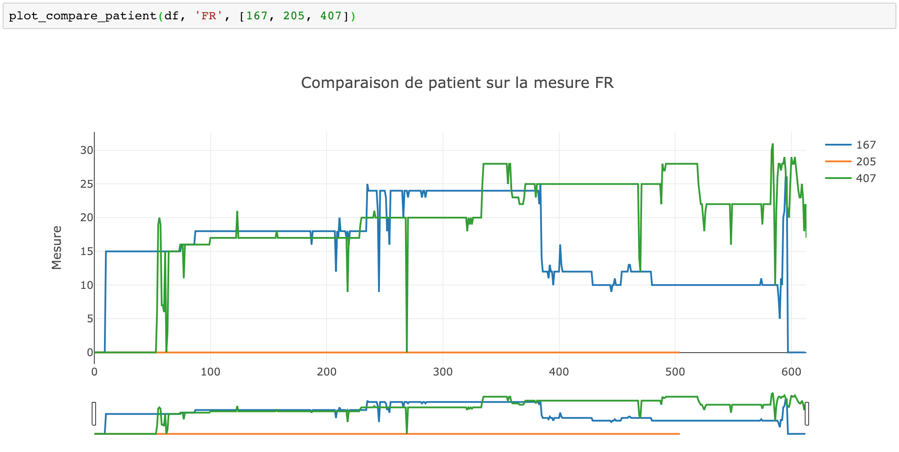
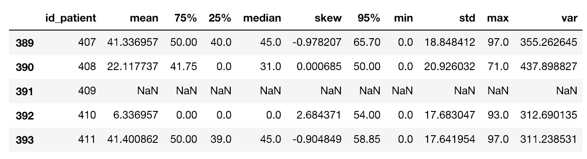
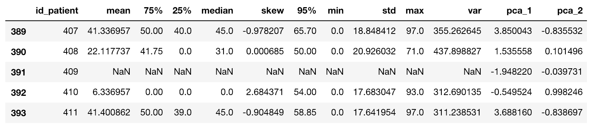
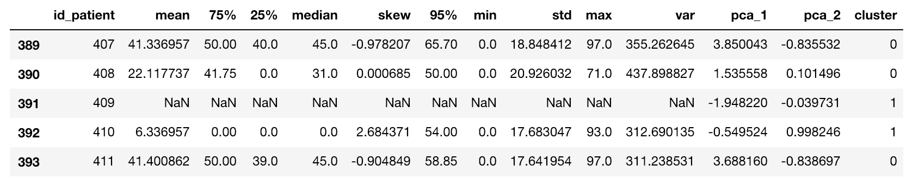
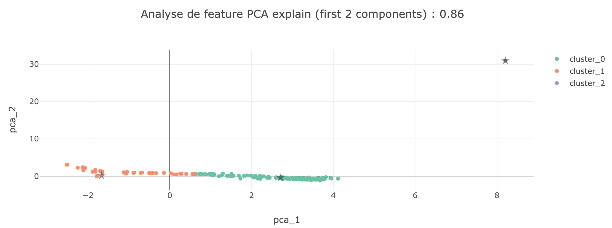

## Classes

Les classes de ce dossier vous permette d'accéder à des fonctions standardisées pour construire et évaluer vos modèles.

_class_ *Dataset*

La classe `Dataset` vous permet d'accéder aux données statiques et dynamiques des patients. Elle est utile pour explorer les données ou constituer un training set standardisé pour développer un modèle.

_Variables_

- **time_offset**: Détermine le moment (en minutes) auquel les données dynamiques seront tronquées. Par exemple, un `time_offset` à 30 signifie que les données dynamiques seront arrêtées 30 minutes avant la dernière mesure enregistrée par les instruments de mesure.

_Fonctions_

  - **get_static**: retourne un `tuple` composé des dataframes `training` et `test` basé sur les données statiques des patients. La colonne `target` est  ajoutée au dataframe `training`. Usage:

  ```python

  from transplant.data.dataset import Dataset

  dataset = Dataset()

  train, test = dataset.get_static()

  ```

  - **get_dynamic**: retourne un `tuple` composé des datframes `training` et `test` basé sur les données  dynamiques des patients. Notez que les données sont filtrées à `time_offset` minutes avant la sortie du bloc. Usage:

  ```python

  from transplant.data.dataset import Dataset

  dataset = Dataset(time_offset=30)

  train, test = dataset.get_dynamic()

  ```

  - **get_dynamic_features**: retourne un dataframe caractérisant les valeurs dynamiques à `time_offset` avant la sortie du bloc.
  - **get_merge_data**: merge de `static` and `dynamic_feature`. Cette fonction retourne un `DataFrame` où chaque ligne correspond à un patient. Les colonnes correspondent à l'ensemble des variables statiques et dynamiques à `time_offset` avant la sortie du bloc.

_class_ *Evaluation*

  - **get_test_data**: retourne un `DataFrame` composé de l'ensemble des données statiques et dynamiques à 30 minutes avant la sortie du bloc.
  - **evaluate_prediction(y)**: affiche des indicateurs de performance du modèle. `y` correspond à un `DataFrame` composé des variables `id_patient` et `prediction`.


_class_ *visualization*

Vous pouvez facilement visualiser et explorer les données dans un notebook. Il est important que `id_patient` soit en colonne dans le *DataFrame*. Nous importerons ici l'integralité du set dynamique: 

  - **import_data**:

```python
import pandas as pd
from transplant.config import *               # import de variables

df = pd.read_csv(PATH_DYNAMIC_CLEAN)

df.tail() # Afficher les données
```


  - **plot_dynamic_features**: Explorer les variables d'un patient

```python
# On reprend notre DataFrame df un peu plus haut
from transplant.visualization.graph import plot_dynamic_features

# On regarde pour le patient n°407 les variables 'B.I.S' et'FR'
plot_dynamic_features(df, 407, ['B.I.S', 'FR'])
```



- **plot_compare_patient**: Comparer une même variable sur plusieurs patients

```python
# On reprend notre DataFrame df un peu plus haut
from transplant.visualization.graph import plot_compare_patient

# On compare la varible 'FR' sur les patient n°167, 205 et 407
plot_compare_patient(df, 'FR', [167, 205, 407])
```



- **plot_analyse_factory**: Permet d'analyser la distribution d'une variable sur l'ensemble des patients grâce à un clustering

Cette fonction est utilisée dans le notebook `notebook/Data Exploration - PCA clustering.ipynb`


## Tools

Le répertoire `tools` permet d'utiliser des classes ou fonctions python pour répondre à un besoin précis. Cela permet d'assurer la reproductibilité des analyses par la suite (notamment dans les nootebooks). 


- **analyse_with_pca.py**: Analyse des données dynamiques par `PCA` et `Kmean`

L'objectif est de pouvoir détecter des erreurs ou anomalies dans les données dynamiques des patients.

1. analyse_feature_by_patient :

  Aggrège différentes statistiques par patient sur une variable données.
  
  ```python
  from transplant.tools.analyse_with_pca import analyse_feature_by_patient

  df_agg = analyse_feature_by_patient(df, 'B.I.S')
  df_agg.tail()
  ```
  
  
  
2. create_pca_feature :
  
   A partir des données aggrégées, on va tout d'abord remplacer les donneés absente par 0, puis les scale pour utiliser un `PCA`
   
  ```python
  from transplant.tools.analyse_with_pca import create_pca_feature
  df_agg_pca, pca, X_pca = create_pca_feature(df_agg)
  df_agg_pca.tail()
  ```
  
  

3. create_cluster :
  
   A partir des données aggrégées avec les PCA, on va utiliser un `Kmean` afin de créer 3 clusters.
   
  ```python
  from transplant.tools.analyse_with_pca import create_cluster
  df_agg_pca_cluster, kmean = create_cluster(df_agg_pca, X_pca)
  df_agg_pca_cluster.tail()
  ```
  
  
  
4. run_pca :

  Permet de pouvoir lancer l'ensemble des fonctions `analyse_feature_by_patient`, `create_pca_feature`, et `create_cluster`.
  On peut ensuite utliser la function de la classe `visualization.plot_analyse_factory` pour analyser le résultat.
  
  ```python
  feature="B.I.S"
  feature_analysis, pca, X_pca, kmean = run_pca(df, feature, cluster=True)
  plot_analyse_factory(feature_analysis, pca, hue=True, kmean=kmean)
  ```
  
  
  
  Ces analyses sont regoupées dans le nootebook `notebook/Data Exploration - PCA clustering.ipynb` 
  
  
## Tests

Ce dossier contient les tests unitaires pour certains composants du projet. Pour lancer tous les tests depuis la racine du repo :


```
python -m unittest discover -v transplant/tests
```
